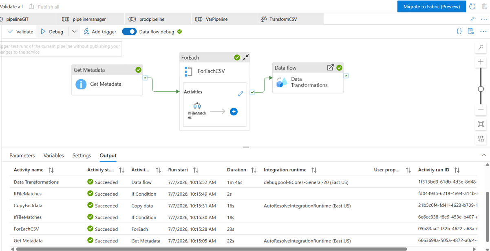
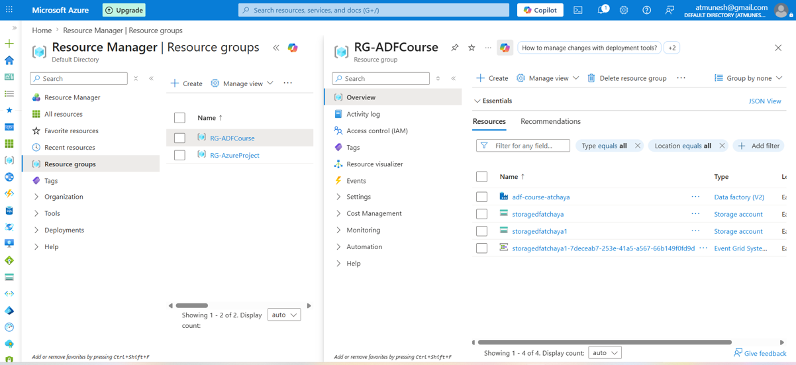
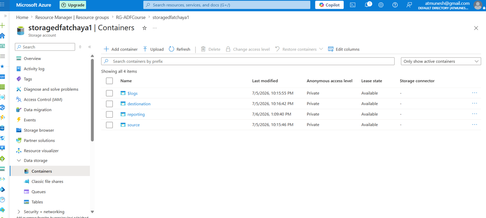
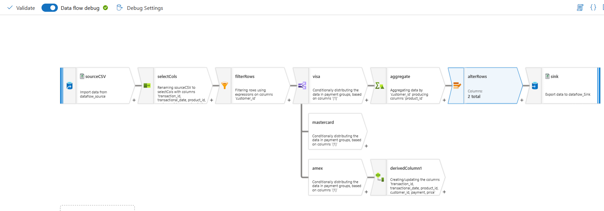

# Azure Data Factory End-to-End ETL Pipeline

## 📌 Overview

This project demonstrates an end-to-end ETL pipeline built using **Azure Data Factory (ADF)**. The solution dynamically processes CSV files stored in Azure Storage using metadata-driven orchestration, parameterized pipelines, and Mapping Data Flows.

The pipeline retrieves files from the source container, processes only the required files, transforms the data, and loads the final output into the destination.

---

## 🛠️ Tech Stack

- Azure Data Factory
- Azure Blob Storage
- Azure Data Lake Storage Gen2
- Azure Integration Runtime
- Mapping Data Flow

---

# Project Architecture

<p align="center">

</p>

---

# Azure Resources

Created the Azure infrastructure required for the project.

- Azure Resource Group
- Azure Data Factory
- Azure Storage Account

<p align="center">

</p>

---

# Azure Storage Containers

Created storage containers to organize the ETL workflow.

- Source
- Reporting
- Destination

<p align="center">

</p>

---

# Pipeline Workflow

The pipeline performs the following activities:

- Get Metadata
- ForEach
- If Condition
- Copy Activity
- Mapping Data Flow

<p align="center">

</p>

---

## Pipeline Logic

```text
Source
   │
Get Metadata
   │
ForEach
   │
If Condition
(File starts with "Fact")
   │
True ─────────► Copy Activity
False ───────► Skip
```

Only files beginning with **Fact** are copied into the **Reporting** container.

---

# Parameterization

The project uses **parameterized datasets and pipelines**.

Instead of hardcoding:

- File names
- Folder paths
- Datasets

parameters are passed dynamically during execution.

Benefits:

- Reusable pipelines
- Dynamic execution
- Easy maintenance
- Scalable architecture

---

# Mapping Data Flow

The Data Flow performs multiple transformations.

- Source
- Select
- Filter
- Conditional Split
- Aggregate
- Derived Column
- Alter Row
- Sink

<p align="center">

</p>

---

## Data Flow Transformations

```text
Source
   │
Select
   │
Filter
   │
Conditional Split
 ┌──────────┬──────────┐
 │          │          │
Visa   MasterCard   Amex
 │          │          │
 ▼          ▼          ▼
Aggregate Derived Column
       │
       ▼
 Alter Row
       │
       ▼
      Sink
```

---

# Successful Pipeline Execution

The pipeline executed successfully with every activity completed.

✔ Get Metadata

✔ ForEach

✔ If Condition

✔ Copy Activity

✔ Mapping Data Flow

<p align="center">

</p>

---

# Key Learnings

- Azure Data Factory
- Azure Storage
- Linked Services
- Datasets
- Integration Runtime
- Parameterization
- Dynamic Content
- Get Metadata
- ForEach
- If Condition
- Copy Activity
- Mapping Data Flow
- ETL Design

---

# Project Outcome

Built a reusable Azure Data Factory pipeline that:

- Dynamically reads files
- Processes only required files
- Performs transformations
- Loads data into the destination
- Demonstrates production-style ETL orchestration

---

## Author

**Atchaya Prabhu**

💼 LinkedIn: https://www.linkedin.com/in/atchaya-prabhu/

💻 GitHub: https://github.com/Atchaya-Prabhu/Azure-Data-Factory
